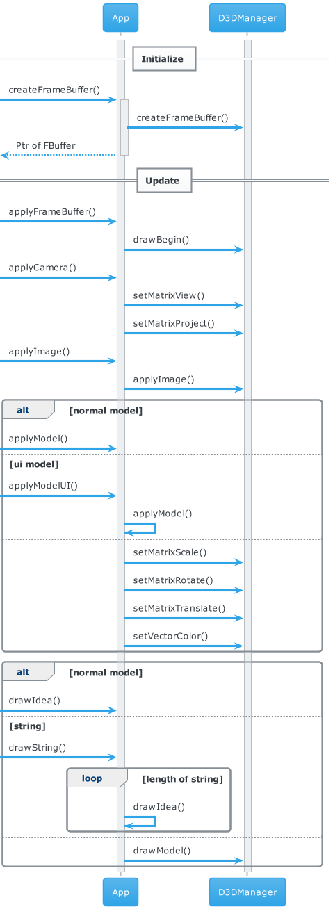

# 射命丸文の弾幕稽古


## ビルド環境

* Windows 10
* Build Tools for Visual Studio 2022 (14.30.30705)
* Windows Kits 10 (10.0.19041.0)

## 命名規則

| 種類 | 命名規則 |
| ----- | ----- |
| クラス・構造体 | 最初大文字のキャメルケース |
| 関数・メソッド | 最初小文字のキャメルケース |
| マクロ定数 | すべて大文字のスネークケース |
| 定数 | 接頭辞`k`のキャメルケース |
| 変数 | すべて小文字のスネークケース |

ただし、ハンガリアン記法を**変に**意識した単語の順序で構成される。
例えば、タイトルシーンはTitleSceneではなくSceneTitle。

## ヘッダーファイルについて

ヘッダーファイル名の先頭に`_`を付してある。

特にDirectXラッパーライブラリに関して、一般的なオブジェクトがincludeすべきヘッダーファイルはない。責任者が_dx11private.hppをincludeし、適切に処理をしなければならない。

## デバッグについて

`App::debug`にconst char\*かintを渡す。ただし、コマンドライン引数に`debug`を与えてth_abp.exeを起動しなければならない。

## モデルの描画について

唯一のモデルバッファをideaと名付けてAppで保有している都合上、四角形しか描画しえない。

## 文字列の描画について

`App::drawString`にconst char\*を渡す。数値を用いたいときは、
```c++
char buf[64] = ""; // 余分に大きく取った配列
snprintf(buf, 64, "+%d bonus", bonus);
p_app->drawString(buf); // 文字のあるところまで適応される
```

## Class

| クラス | 説明 |
| ----- | ---------- |
| App | アプリ全体を調停する |
| Camera | カメラ |
| Model | モデル |
| Entity | エンティティすべてが継承する |
| Scene | 各シーンを管理する |

## UML

### 全体の流れ


### 描画


